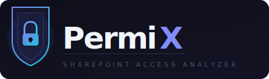
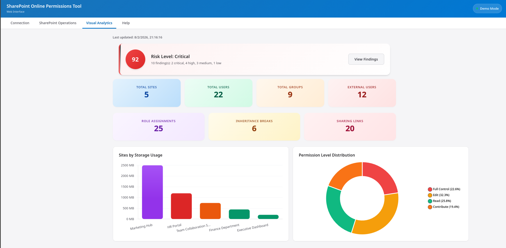
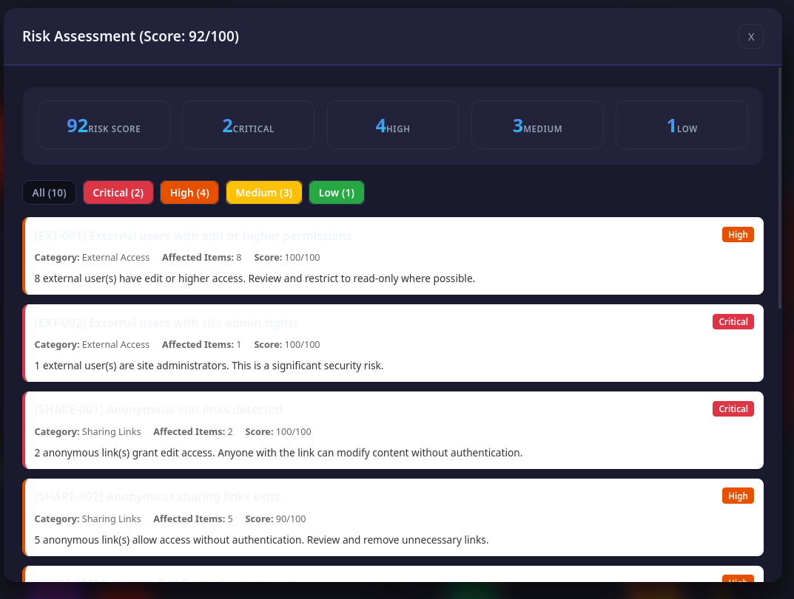

<div align="center">


<p align="center">
  
</p>

Ever wondered who actually has access to what in your SharePoint environment? This tool answers that question — with **risk scoring**, **external user enrichment via Microsoft Graph**, and **interactive visual analytics**.

Spot security risks, stale accounts, anonymous sharing links, and broken inheritance across your entire SharePoint Online tenant, all from a clean browser-based dashboard.

Runs as a **container** (zero local setup) or a **local web server**. No agents, no cloud services — just PowerShell, a browser, and your app registration.

> **Note**: As of 08/02/2026, the XAML/WPF desktop version has been removed. The web interface covers all features and works on any OS.

[Quick Start](#quick-start) | [Container](#container-deployment) | [Features](#features) | [Screenshots](#screenshots) | [App Registration](#app-registration)

</div>

---

## Quick Start

### Option A: Container ✅ recommended

Zero local dependencies — just Podman or Docker.

```bash
git clone https://github.com/CreativeAcer/SPO-Permissions-Analyzer.git
cd SPO-Permissions-Analyzer
podman compose up        # or: docker compose up
```

Open `http://localhost:8080` and you're in.

### Option B: Local Web Server

Requires PowerShell 7+ and PnP.PowerShell.

```powershell
git clone https://github.com/CreativeAcer/SPO-Permissions-Analyzer.git
cd SPO-Permissions-Analyzer
.\Install-Prerequisites.ps1
.\Start-SPOTool-Web.ps1    # opens http://localhost:8080
```

### Not ready to connect yet?

Hit **Demo Mode** on the Connection tab — it loads realistic sample data so you can explore every feature without a SharePoint connection.

---

## Container Deployment

### Prerequisites

[Podman](https://podman.io/) or [Docker](https://docs.docker.com/get-docker/)

### Commands

| Command | Description |
|---------|-------------|
| `podman compose up` | Web UI at localhost:8080 (default) |
| `podman compose down` | Stop the container |
| `podman build -t spo-analyzer .` | Build image only |
| `podman run -p 8080:8080 spo-analyzer` | Run without compose |

### Live SharePoint Connection

The container uses **device code flow** for authentication (no browser popup needed).

**Auto-connect on startup** — uncomment and set env vars in `compose.yaml`:

```yaml
environment:
  - SPO_TENANT_URL=https://yourtenant.sharepoint.com
  - SPO_CLIENT_ID=your-app-registration-guid
```

The device code appears in the container terminal. Open `https://microsoft.com/devicelogin`, enter the code, and the web server starts already connected.

**Connect via the UI** — click "Connect to SharePoint" in the browser. The device code appears in the container terminal (`podman logs <container>`). Authenticate at the device login URL; the UI updates when complete.

---

## Features

### 🔐 Permission Analysis
- Site-level permissions with inheritance detection
- User enumeration with internal/external classification
- Group analysis with member counts
- Role assignment mapping across all resources
- Permission inheritance tree with broken inheritance detection
- Sharing link audit (anonymous, company-wide, specific-people)

### ⚠️ Risk Assessment
- **11 security rules** across Critical, High, Medium, and Low severity levels
- **Overall risk score** (0-100) with a color-coded dashboard banner — you'll know immediately if something's wrong
- **Catches**: external admins, anonymous edit links, excessive permissions, broken inheritance, stale accounts, empty groups
- **Filterable findings** by severity with detailed remediation guidance

### 👥 External User Enrichment
- **Microsoft Graph integration** — enriches external users with live account status
- **Stale account detection** — flags accounts inactive for 90+ days
- **Account status tracking** — Active, Disabled, or Never signed in
- **Domain analysis** — aggregates external users by organization so you can see who's really in your tenant

### 🔎 Deep Dive Views
- **Sites** — storage analysis, health scoring, filterable grid
- **Users** — permission breakdown, internal vs external classification
- **Groups** — membership analysis, empty group detection
- **External Users** — domain analysis, access audit, enrichment with stale warnings
- **Role Assignments** — principal-to-permission mapping with security review
- **Inheritance** — broken inheritance overview with percentage scoring + **interactive tree view** showing the full parent-child hierarchy
- **Sharing Links** — link type distribution, anonymous edit detection

### 🖱️ Interactive UI
- **Global search** — Omnibox (Ctrl+K / Cmd+K) searches across sites, users, and groups instantly
- **Clickable charts** — click any bar or segment to drill straight into the underlying data
- **Tree visualizations** — collapsible hierarchical view of permission inheritance
- **Export anywhere** — CSV or JSON with a format chooser modal on every table
- Sortable/filterable tables with real-time search
- Responsive design for desktop and mobile

---

## Security Rules

11 rules evaluate your environment across five categories: External Access, Sharing Links, Permissions, Inheritance, and Groups.

| Severity | What it catches |
|----------|----------------|
| 🔴 **Critical** | External site admins, anonymous edit links |
| 🟠 **High** | External users with elevated permissions, anonymous links, excessive Full Control, broken inheritance |
| 🟡 **Medium** | Multiple external domains, excessive org-wide links, direct user assignments |
| 🔵 **Low** | Empty groups |

Risk score (0–100) is calculated from the top 5 findings. Levels: **Critical** 80+, **High** 60–79, **Medium** 30–59, **Low** 1–29, **None** 0.

---

## Screenshots

<div align="center">
<p>
  
</p>
<p>
  
  
</p>
<em>Modern web interface with risk assessment, visual analytics, and external user enrichment.</em>
</div>

---

## App Registration

You need an Azure AD App Registration to connect to SharePoint Online.

### 1. Create the registration

1. **Azure Portal** > **App registrations** > **New registration**
2. Name: `SharePoint Permissions Analyzer`
3. Account types: **Single tenant**
4. Authentication > **Allow public lcient flows** > `Yes`
5. Redirect URI: **Public client/native (Web)** > `http://localhost` and `https://login.microsoftonline.com/common/oauth2/nativeclient`


### 2. Add API permissions

| API | Permission | Type |
|-----|-----------|------|
| Microsoft Graph | Sites.FullControl.All | Delegated |
| Microsoft Graph | User.Read.All | Delegated |
| Microsoft Graph | GroupMember.Read.All | Delegated |
| SharePoint | AllSites.FullControl | Delegated |

> **Why FullControl?** This is a read-only tool, but SharePoint treats reading RoleAssignments and RoleDefinitionBindings as a privileged operation. `Sites.Read.All` / `AllSites.Read` is insufficient.
>
> The signed-in user must also be a **SharePoint Administrator** for tenant-wide site enumeration to work.

Click **Grant admin consent** after adding all permissions.

### 3. Enable public client

**Authentication** > **Allow public client flows** > **Yes** > **Save**

---

## Project Structure

```
SPO-Permissions-Analyzer/
├── Start-SPOTool-Web.ps1           # 🚀 Web UI entry point (local mode)
├── Dockerfile                      # 🐳 Container image definition
├── compose.yaml                    # 📦 Podman/Docker Compose config
├── docker-entrypoint.ps1           # ⚙️  Container startup script
├── Install-Prerequisites.ps1       # 📥 Module installer for local mode
│
├── Functions/
│   ├── Core/                       # 🧠 Core infrastructure & utilities
│   │   ├── AuditLog.ps1            #    Audit trail logging
│   │   ├── Checkpoint.ps1          #    Analysis checkpoint/resume support
│   │   ├── Logging.ps1             #    General logging helpers
│   │   ├── OutputAdapter.ps1       #    Output formatting adapter
│   │   ├── Settings.ps1            #    Configuration management
│   │   ├── SharePointDataManager.ps1 #  Central data store & caching
│   │   └── ThrottleProtection.ps1  #    API throttle/rate-limit handling
│   │
│   ├── Analysis/                   # 🔍 Data analysis & enrichment
│   │   ├── GraphEnrichment.ps1     #    Microsoft Graph user enrichment
│   │   ├── JsonExport.ps1          #    JSON export formatting
│   │   └── RiskScoring.ps1         #    Security risk scoring engine
│   │
│   ├── SharePoint/                 # 🏢 SharePoint data collection
│   │   ├── PermissionsCollector.ps1 #   Collects all permission assignments
│   │   ├── PermissionsMatrix.ps1   #    Builds permission matrix view
│   │   ├── SiteCollector.ps1       #    Site enumeration & metadata
│   │   └── SPOConnection.ps1       #    Authentication & connection handling
│   │
│   ├── Server/                     # 🌐 Web server & API backend
│   │   ├── ApiHandlers.ps1         #    REST API route handlers
│   │   ├── BackgroundJobManager.ps1 #   Background analysis job runner
│   │   └── WebServer.ps1           #    HTTP server (PowerShell HttpListener)
│   │
│   └── Demo/                       # 🎭 Demo mode
│       └── DemoDataGenerator.ps1   #    Generates realistic sample data
│
├── Web/                            # 🖥️  Browser-based frontend
│   ├── index.html                  #    Single-page app shell
│   ├── css/
│   │   ├── app.css                 #    Core styles & layout
│   │   └── enhancements.css        #    Extended components & animations
│   └── js/
│       ├── app.js                  #    App bootstrap & tab routing
│       ├── app-state.js            #    Shared application state
│       ├── api.js                  #    Backend API client
│       ├── analytics.js            #    Analytics tab logic
│       ├── charts.js               #    Chart rendering (Chart.js)
│       ├── connection.js           #    Connection tab & auth flow
│       ├── deep-dives.js           #    Deep dive modal views
│       ├── export.js               #    CSV/JSON export logic
│       ├── operations.js           #    Operations tab logic
│       ├── permissions-matrix.js   #    Permissions matrix view
│       ├── search.js               #    Global omnibox search (Ctrl+K)
│       └── ui-helpers.js           #    Shared UI utilities
│
├── Images/                         # 📸 Screenshots for documentation
└── Logs/                           # 📋 Runtime logs (auto-created)
```

---

## Troubleshooting

| Problem | Solution |
|---------|----------|
| "Access is denied" | Verify app registration permissions and admin consent |
| "PnP PowerShell module not found" | Run `Install-Prerequisites.ps1` or `Install-Module PnP.PowerShell -Force` |
| "Connection timeout" | Check network; ensure redirect URI is `http://localhost` |
| Execution policy error | `Set-ExecutionPolicy -ExecutionPolicy RemoteSigned -Scope CurrentUser` |
| Container auth not working | Check the container terminal for the device code; ensure `SPO_HEADLESS=true` is set |

Detailed logs live in `./Logs/`. When in doubt, **Demo Mode** is a great way to confirm whether the issue is connection-related or not.

---

## Contributing

Contributions are welcome! Fork the repo, create a feature branch, and open a pull request. Bug reports, ideas, and feedback via [Issues](https://github.com/CreativeAcer/SPO-Permissions-Analyzer/issues) are equally appreciated.

---

## License

MIT — see [LICENSE](LICENSE).

---

<div align="center">

**[Report an Issue](https://github.com/CreativeAcer/SPO-Permissions-Analyzer/issues)** | **[Discussions](https://github.com/CreativeAcer/SPO-Permissions-Analyzer/discussions)**

Made with care by [CreativeAcer](https://github.com/CreativeAcer)

</div>
