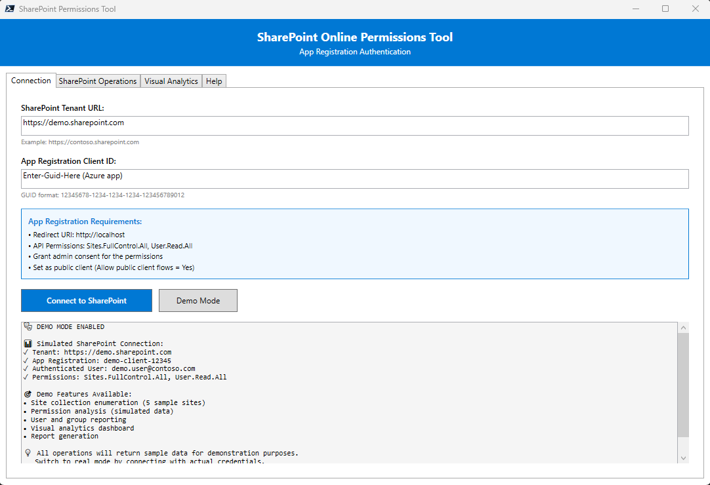
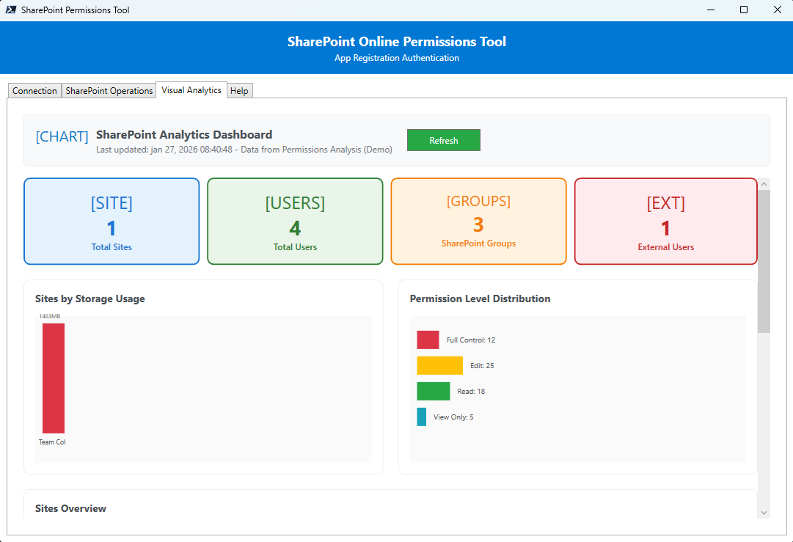
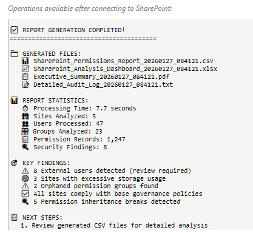
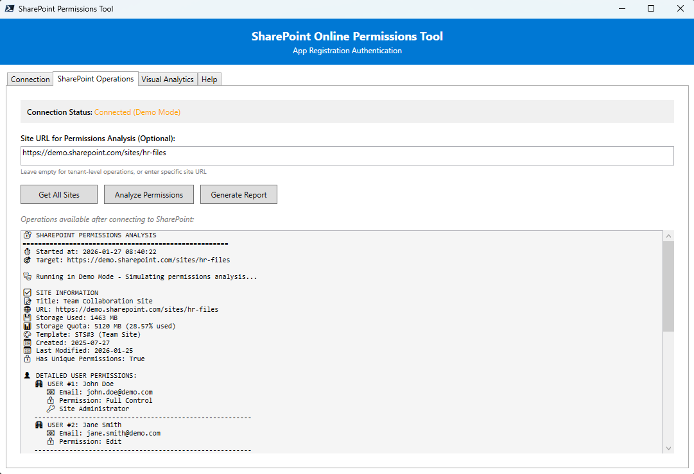

# 🔐 SharePoint Online Permissions Report Tool  [](https://www.codefactor.io/repository/github/creativeacer/spo-permissions-analyzer)

<div align="center">


**Professional PowerShell WPF application for comprehensive SharePoint Online permissions analysis**

[Features](#-features) • [Quick Start](#-quick-start) • [Screenshots](#-screenshots) • [Documentation](#-documentation) • [Contributing](#-contributing)

</div>

---

## 🌟 Overview

The **SharePoint Online Permissions Report Tool** is a modern, enterprise-grade PowerShell application that provides comprehensive analysis of SharePoint Online site permissions, users, groups, and security settings. Built with PowerShell 7 and PnP PowerShell 3.x, it offers a professional WPF interface for easy permission auditing and reporting.

### ✨ Key Highlights

- 🎨 **Modern WPF Interface** - Professional desktop application with intuitive design
- 🔐 **App Registration Authentication** - Secure authentication using Azure AD app registrations
- 📊 **Comprehensive Analysis** - Deep dive into permissions, users, groups, and security settings
- 📋 **Multiple Export Formats** - Excel, CSV, HTML, and JSON reporting capabilities
- 🔄 **Real-time Processing** - Live progress updates and responsive UI
- 🛡️ **Enterprise Security** - Built for security-conscious organizations
- 🎯 **Demo Mode** - Test functionality without live SharePoint connections

---

## 🚀 Features

### 🔍 **Permission Analysis**
- **Site-level permissions** with inheritance detection
- **User enumeration** with detailed profile information
- **Group analysis** with member categorization
- **Role assignment mapping** - Who has what permission on what resource
- **Permission inheritance tree** - Detects broken inheritance at site, list, and library levels
- **Sharing link audit** - Enumerates anonymous, company-wide, and specific-people links
- **Security settings audit** including site features and configurations

### 📈 **Deep Dive Analysis**
- **Sites Deep Dive** - Storage analysis, site health scoring, hub site tracking, detailed grid with search and filters
- **Users Deep Dive** - Permission level breakdown, internal vs external classification, security risk assessment (low/medium/high)
- **Groups Deep Dive** - Membership analysis, size distribution, group health checks (empty groups, missing owners, oversized groups)
- **External Users Deep Dive** - Domain analysis, access level audit (read/edit/full control), security findings and recommendations

### 🔑 **Core Security Analysis**
- **Role Assignment Mapping** - Maps every principal (user/group) to their exact permission level at each scope (site/list/library), with security risk scoring and filterable deep dive
- **Permission Inheritance Tree** - Scans all lists and libraries for broken inheritance, summarizes break percentages per site, flags complexity with actionable recommendations
- **Sharing Links Audit** - Identifies anonymous links (highest risk), company-wide links, and specific-people links; highlights anonymous edit access as critical; provides exportable security findings

### 📋 **Reporting & Export**
- **CSV export** from every deep dive window via file picker
- **Site collection administrator tracking**
- **Guest user identification** and access analysis
- **Comprehensive permission matrices**

### 🎨 **User Experience**
- **Tabbed interface** for organized workflows
- **Real-time status updates** during operations
- **Progress indicators** for long-running tasks
- **Detailed error messages** with troubleshooting guidance
- **Responsive design** that scales with content

### 🔧 **Technical Features**
- **Modern PnP PowerShell 3.x** integration
- **PowerShell 7** optimized for performance
- **Async operations** for UI responsiveness
- **Comprehensive logging** with activity and error tracking
- **Configuration management** with persistent settings

---

## 🏁 Quick Start

### Prerequisites

- **PowerShell 7.0+** ([Download here](https://github.com/PowerShell/PowerShell/releases))
- **SharePoint Online** access with appropriate permissions
- **Azure AD App Registration** (instructions included)

### 📦 Installation

1. **Clone the repository**
   ```powershell
   git clone https://github.com/CreativeAcer/SPO-Permissions-Analyzer.git
   cd SPO-Permissions-Analyzer
   ```

2. **Run the prerequisites installer**
   ```powershell
   .\Install-Prerequisites.ps1
   ```

3. **Launch the application**

   **Option A: Desktop (WPF)**
   ```powershell
   .\Start-SPOTool.ps1
   ```

   **Option B: Web UI (Browser)**
   ```powershell
   .\Start-SPOTool-Web.ps1
   ```
   Opens `http://localhost:8080` in your default browser. Same backend, modern web frontend with Chart.js charts.

That's it! The application creates any needed directories automatically and manages all settings in-memory.

### 🎯 Quick Test with Demo Mode

Want to see the tool in action? Try **Demo Mode**:

1. Launch the application (either WPF or Web version)
2. Click **"Demo Mode"** on the Connection tab
3. Explore all features with realistic sample data
4. No SharePoint connection required!

---

## 🖼️ Screenshots

<div align="center">

<p align="center">
  
  
</p>

<p align="center">
  
  
</p>

</div>

---

## 📋 App Registration Setup

### Step 1: Create App Registration

1. Go to **Azure Portal** → **App registrations** → **New registration**
2. **Name**: `SharePoint Permissions Tool`
3. **Account types**: `Single tenant`
4. **Redirect URI**: `Web` → `http://localhost`

### Step 2: Configure Permissions

Add these **API permissions**:

#### Microsoft Graph (Delegated)
- `Sites.Read.All` or `Sites.FullControl.All`
- `User.Read.All`
- `Group.Read.All`

#### SharePoint (Delegated)
- `AllSites.Read` or `AllSites.FullControl`

### Step 3: Enable Public Client

1. Go to **Authentication**
2. Set **Allow public client flows** → `Yes`
3. **Save** the configuration

### Step 4: Grant Admin Consent

Click **"Grant admin consent for [your organization]"** for all permissions.

---

## 🛠️ Usage Guide

### Basic Workflow

1. **Connect to SharePoint**
   - Enter your tenant URL and app registration Client ID
   - Complete authentication in the popup window
   - Verify successful connection

2. **Discover Sites**
   - Use "Get All Sites" to enumerate tenant sites
   - Copy URLs for specific site analysis

3. **Analyze Permissions**
   - Enter a specific site URL
   - Click "Analyze Permissions"
   - Review comprehensive security report

4. **Generate Reports**
   - Export findings to multiple formats
   - Save for compliance and auditing

### Advanced Features

#### Site-Specific Analysis
```
Examples of supported URLs:
• https://tenant.sharepoint.com/sites/teamsite
• https://tenant.sharepoint.com/sites/project-alpha
• https://tenant.sharepoint.com (tenant root)
```

#### Batch Processing
- Analyze multiple sites sequentially
- Maintain authentication across operations
- Consolidated reporting capabilities

---

## 📁 Project Structure

```
📦 SPOPermissionsBase/
├── 🚀 Start-SPOTool.ps1              # Main application entry point
├── ⚙️ Install-Prerequisites.ps1      # Automated setup script
├── 📖 README.md                     # This documentation
├── 📂 Views/                        
│   ├── 📂 Windows/
│   │   └── MainWindow.xaml          # ← Main window XAML
│   └── 📂 DeepDive/
│       ├── SitesDeepDive.xaml           # Sites deep dive window
│       ├── UsersDeepDive.xaml           # Users deep dive window
│       ├── GroupsDeepDive.xaml          # Groups deep dive window
│       ├── ExternalUsersDeepDive.xaml   # External users deep dive window
│       ├── PermissionsDeepDive.xaml     # Role assignment mapping window
│       ├── InheritanceDeepDive.xaml     # Permission inheritance window
│       └── SharingLinksDeepDive.xaml    # Sharing links audit window
├── 📂 Functions/                    # Core functionality
│   ├── 📂 Core/                    # Foundation components
│   │   ├── Settings.ps1            # In-memory settings management
│   │   ├── SharePointDataManager.ps1 # Management for retrieved data
│   │   └── Logging.ps1             # Activity and error logging
│   ├── 📂 SharePoint/              # SharePoint operations
│   │   └── SPOConnection.ps1       # Authentication and data retrieval
│   └── 📂 UI/                      # User interface
│       ├── UIManager.ps1           # UI state management
│       ├── MainWindow.ps1           # Main window loader & coordinator
│       ├── ConnectionTab.ps1        # Connection tab logic
│       ├── OperationsTab.ps1        # SharePoint Operations tab logic
│       ├── VisualAnalyticsTab.ps1   # Visual Analytics tab logic
│       └── HelpTab.ps1             # Help tab logic (minimal)
│       └── 📂 DeepDive/
│           ├── SitesDeepDive.ps1        # Sites deep dive logic
│           ├── UsersDeepDive.ps1        # Users deep dive logic
│           ├── GroupsDeepDive.ps1       # Groups deep dive logic
│           ├── ExternalUsersDeepDive.ps1 # External users deep dive logic
│           ├── PermissionsDeepDive.ps1  # Role assignment mapping logic
│           ├── InheritanceDeepDive.ps1  # Permission inheritance logic
│           └── SharingLinksDeepDive.ps1 # Sharing links audit logic
├── 📂 Logs/                        # Application logs (created automatically)
└── 📂 Reports/                     # Generated reports (created automatically)
    └── Generated/                  # Output directory
```

---

## ⚙️ Configuration

The application uses **in-memory configuration** - no external config files required! Settings are managed internally by the PowerShell scripts and persist during the session.

### Key Settings Managed Automatically
- **SharePoint Connection**: Tenant URL and Client ID (entered via UI)
- **Demo Mode**: Toggle for testing without live connections  
- **UI State**: Window sizes and control states
- **Logging**: Activity and error logging (automatic)

### Manual Configuration (Optional)
```powershell
# Disable PnP update notifications (optional)
$env:PNPPOWERSHELL_UPDATECHECK = "Off"
```

### Runtime Settings
All configuration is handled through the application interface:
1. **Tenant URL** - Enter in the Connection tab
2. **Client ID** - Enter your app registration GUID
3. **Site URLs** - Enter specific sites to analyze
4. **Output Options** - Choose export formats and locations

---

## 🐛 Troubleshooting

### Common Issues

#### 🔴 "Access is denied" errors
**Solution**: Verify your app registration has the required permissions and admin consent has been granted.

#### 🔴 "PnP PowerShell module not found"
**Solution**: Run `Install-Prerequisites.ps1` or manually install:
```powershell
Install-Module PnP.PowerShell -Force -AllowClobber -Scope CurrentUser
```

#### 🔴 "Connection timeout"
**Solution**: Check your network connection and ensure the app registration redirect URI is set to `http://localhost`.

#### 🔴 PowerShell execution policy
**Solution**: Set execution policy (run PowerShell as Administrator):
```powershell
Set-ExecutionPolicy -ExecutionPolicy RemoteSigned -Scope CurrentUser
```

### Getting Help

1. **Check the logs** in `./Logs/` directory
2. **Try Demo Mode** to isolate issues
3. **Verify app registration** configuration
4. **Review permissions** with your SharePoint administrator

---

## 🧪 Development

### Requirements
- PowerShell 7.0+
- PnP PowerShell 3.x
- Visual Studio Code (recommended)
- PowerShell Extension for VS Code

### Building from Source
```powershell
# Clone repository
git clone https://github.com/CreativeAcer/SPO-Permissions-Analyzer.git
cd SPO-Permissions-Analyzer

# Install dependencies
.\Install-Prerequisites.ps1 -Force

# Run in development mode
.\Start-SPOTool.ps1
```

### Testing
```powershell
# Test with Demo Mode (no SharePoint required)
.\Start-SPOTool.ps1
# Click "Demo Mode" in the application
```

---

## 🤝 Contributing

We welcome contributions! Please see our [Contributing Guidelines](CONTRIBUTING.md) for details.

### How to Contribute

1. **Fork** the repository
2. **Create** a feature branch (`git checkout -b feature/amazing-feature`)
3. **Commit** your changes (`git commit -m 'Add amazing feature'`)
4. **Push** to the branch (`git push origin feature/amazing-feature`)
5. **Open** a Pull Request

### Development Guidelines

- Follow PowerShell best practices
- Include comprehensive error handling
- Add logging for debugging
- Update documentation for new features
- Test with both real and demo data

---

## 📄 License

This project is licensed under the MIT License - see the [LICENSE](LICENSE) file for details.

---

## 🙏 Acknowledgments

- **PnP PowerShell Team** - For the excellent SharePoint PowerShell modules
- **Microsoft** - For SharePoint Online and Azure AD platforms
- **PowerShell Community** - For inspiration and best practices
- **Contributors** - Thank you for making this tool better

---

## 📞 Support

- 🐛 **Issues**: [GitHub Issues](https://github.com/CreativeAcer/SPO-Permissions-Analyzer/issues)
- 💬 **Discussions**: [GitHub Discussions](https://github.com/CreativeAcer/SPO-Permissions-Analyzer/discussions)

---

<div align="center">

**⭐ Star this repository if it helped you! ⭐**

Made with ❤️ by [CreativeAcer](https://github.com/CreativeAcer)

</div>
